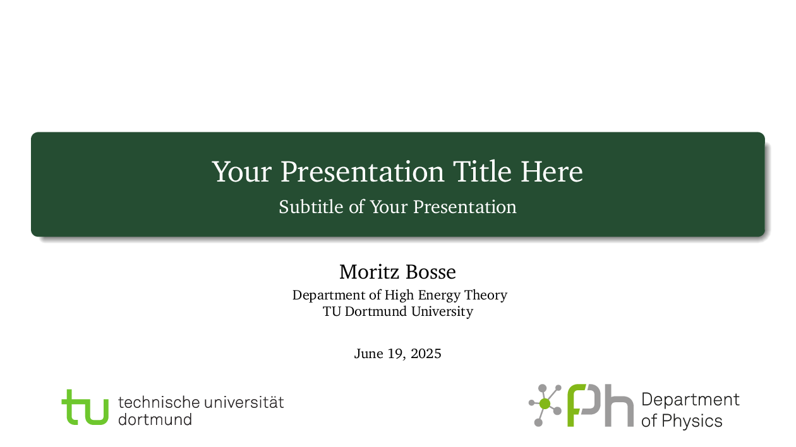
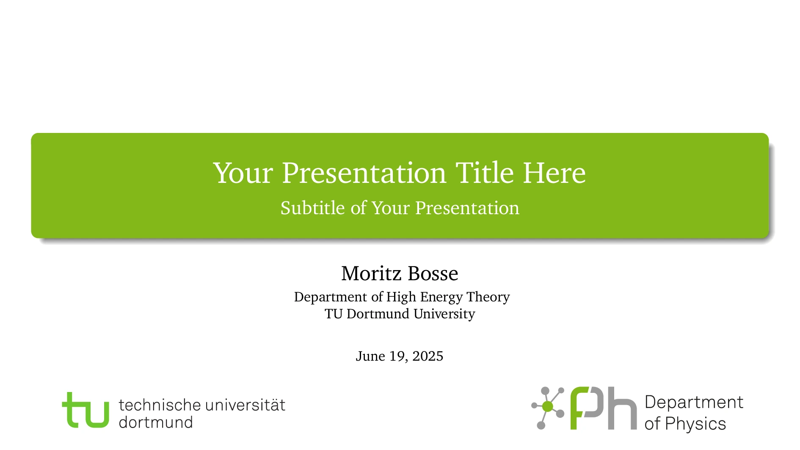
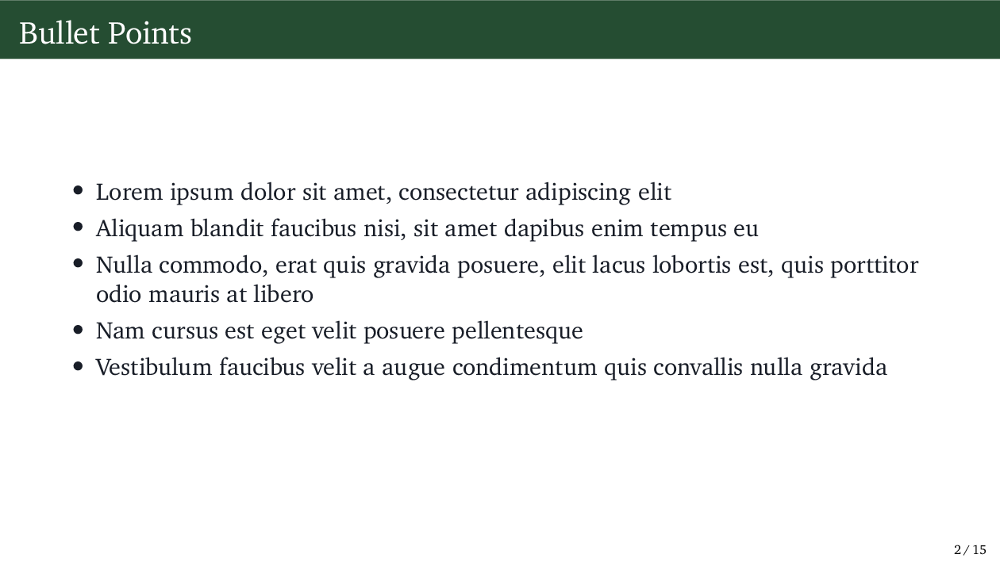
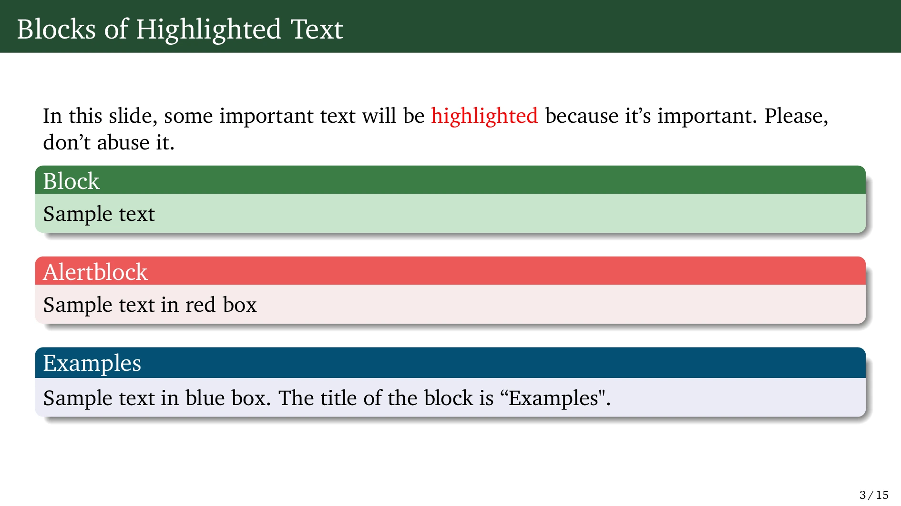
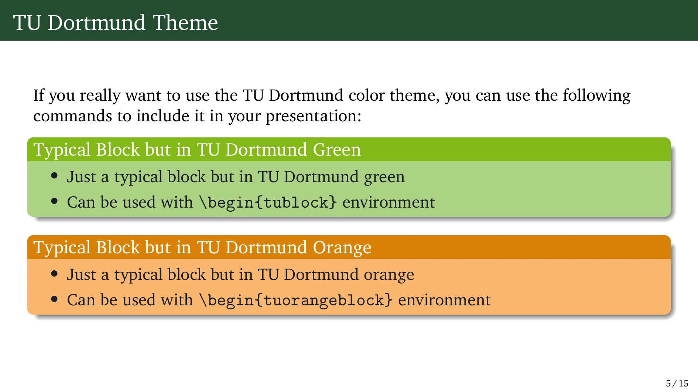
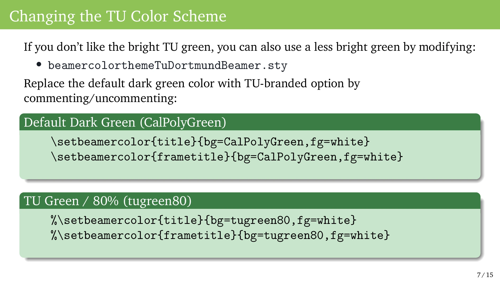
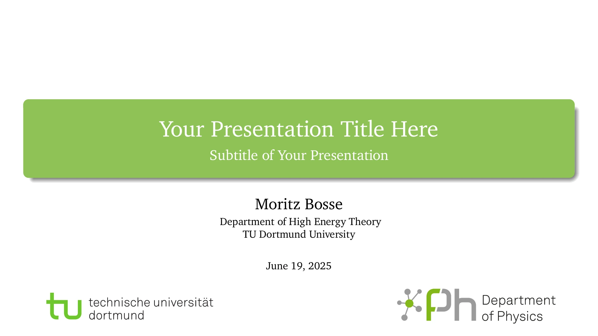
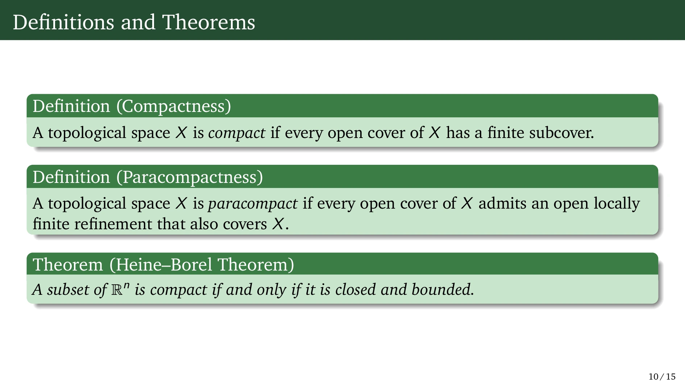
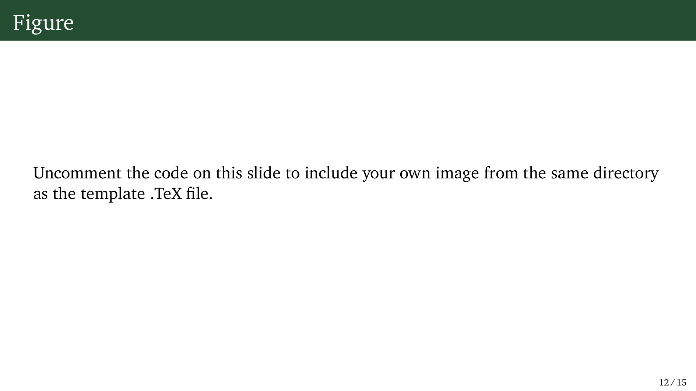

<p align="center">
  
  
</p>

# 🟢 TU Dortmund Beamer Theme

The **TU Dortmund Beamer Theme** is an unofficial Beamer theme inspired by the TU Dortmund corporate design. It’s a work in progress aiming to be simple, clean, and usable. It provides support for official TU colors, clear typography, and custom block environments.

> This template is self-contained, easy to adapt, and includes examples for blocks, theorems, columns, and more.

---

## 🚀 Features

- TU Dortmund official green (`tugreen`) and orange (`tuorange`) theme options
- Additional color variants supported: `tugreen80`, `CalPolyGreen`
- Custom block environments:
  - `tublock`, `tuorangeblock`, `blueblock`, `greenblock`, plus standard `block`, `alertblock`, and `example` blocks
- Customized title and section styles
- Easily adjustable header color and layout
- Includes a complete example presentation

---

## 📦 Requirements

To compile this theme, make sure you have the following installed:

- A LaTeX distribution (TeX Live, MiKTeX, MacTeX, etc.)
- The **Beamer** package
- The **XCharter** font:
  - Install using your LaTeX package manager (e.g., `tlmgr install xcharter`)
- Additional commonly used packages:
  - `hyperref`, `tikz`, `siunitx`, `graphicx`, `booktabs`, `fontenc`

> ⚠️ If using `mathdesign`, be aware that it may conflict with `XCharter`. Ensure compatibility based on your use case.

---

## 📁 Files

- `main.tex` — Main presentation source
- `beamerthemetuDortmundBeamer.sty` — Main theme file
- `beamercolorthemeTuDortmundBeamer.sty` — TU color setup (customizable)
- `beamerinnerthemetuDortmundBeamer.sty` — Inner theme for custom block styling
- `beamerfontthemetuDortmundBeamer.sty` — Font theme based on XCharter
- `reference.bib` — Example bibliography (optional)
- `preview/` — Contains preview images of example slides

---

## 🎨 Customization

You can switch between TU Dortmund color options inside `beamercolorthemeTuDortmundBeamer.sty`:

```latex
% GENERAL DARK GREEN THEME
\setbeamercolor{title}{bg=CalPolyGreen,fg=white}
\setbeamercolor{frametitle}{bg=CalPolyGreen,fg=white}

% TU OPTION (BRIGHT GREEN)
%\setbeamercolor{title}{bg=tugreen,fg=white}
%\setbeamercolor{frametitle}{bg=tugreen,fg=white}

% TU OPTION (LESS BRIGHT GREEN)
%\setbeamercolor{title}{bg=tugreen80,fg=white}
%\setbeamercolor{frametitle}{bg=tugreen80,fg=white}
```
---

## Preview

Below are some example slides created with the SimpleDarkBlue Beamer Theme:













